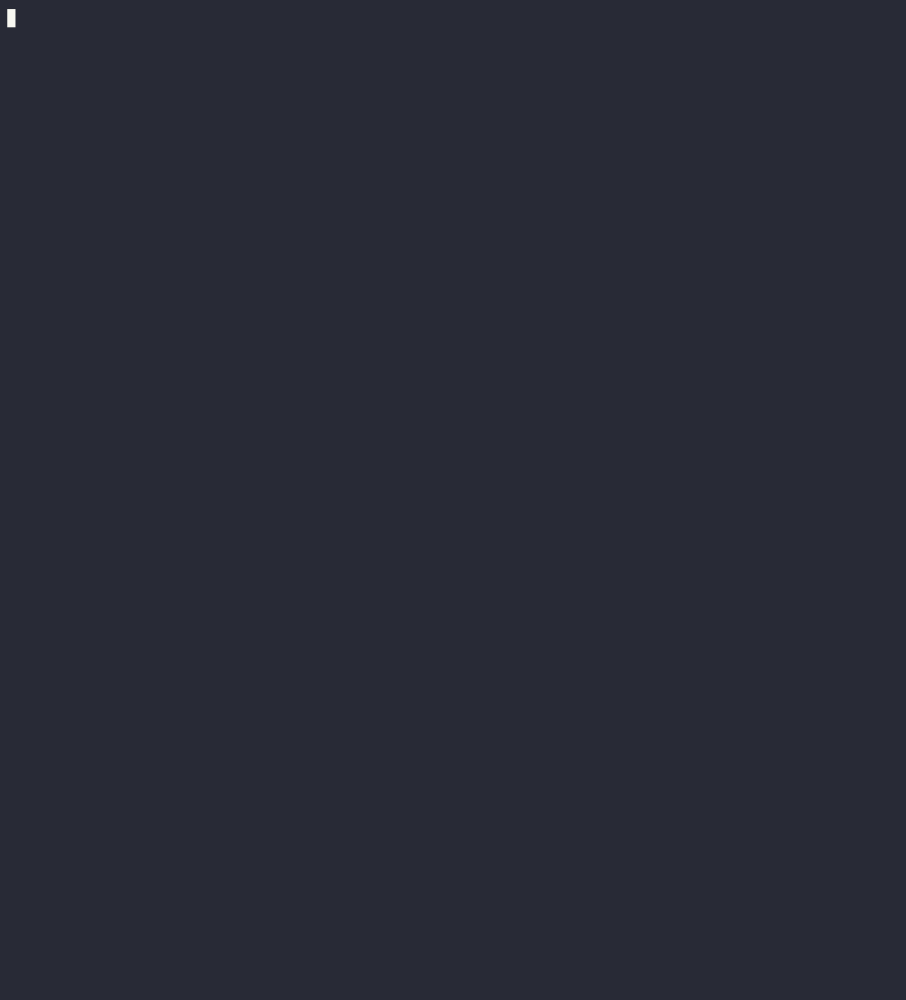

# Terraform Provider for the SysEleven Cloud IAM

## Usage

The user documentation is found at the [docs](docs/index.md).

## Building

Run `make terraform-provider-sys11iam` to build. This results in the binary `terraform-provider-sys11iam`.

## Installing

Run `go install .` to install the binary to your local golang binary path. This should result
in a deployment to `~/go/bin/terraform-provider-sys11iam`, where `terraform` can find it.

## Running

See the section "Testing (e2e)" about how to run it locally. Adjust the example values in the
file `main.tf` to run it against a live environment.

## Testing (unit)

Run `make unit-test` to run the unit tests including the `keycloak` and `glue-api` client.

## Demo

See the plugin in action:

