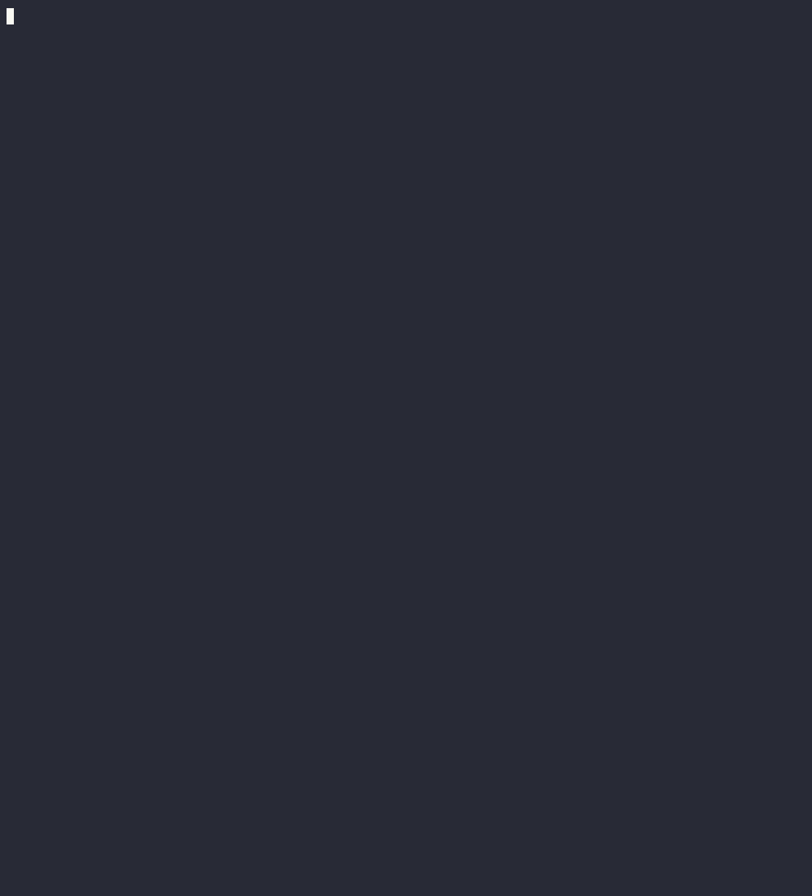

# terraform-provider-ncs

## Building

Run `make terraform-provider-ncs` to build. This results in the binary `terraform-provider-ncs`.

## Installing

Run `go install .` to install the binary to your local golang binary path. This should result
in a deployment to `~/go/bin/terraform-provider-ncs`, where `terraform` can find it.

## Running

See the section "Testing (e2e)" about how to run it locally. Adjust the example values in the
file `main.tf` to run it against a live environment.

## Testing (unit)

Run `make unit-test` to run the unit tests including the `keycloak` and `glue-api` client.

## Testing (e2e)

Clone the repository https://gitlab.syseleven.de/ncs/glue-e2e-testing for a full offline
testing environment.

Run `docker compose up glue-api wiremock` in the cloned repository.

See the `main.tf` in this repository for example values pointing to both the
`keycloak` container and the `glue-api` container.

Run `TF_LOG=DEBUG terraform apply -auto-approve` to apply the contents of the `main.tf`
in this repositories directory against the docker container composition.

## Demo

See the plugin in action:

